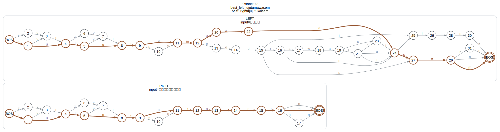
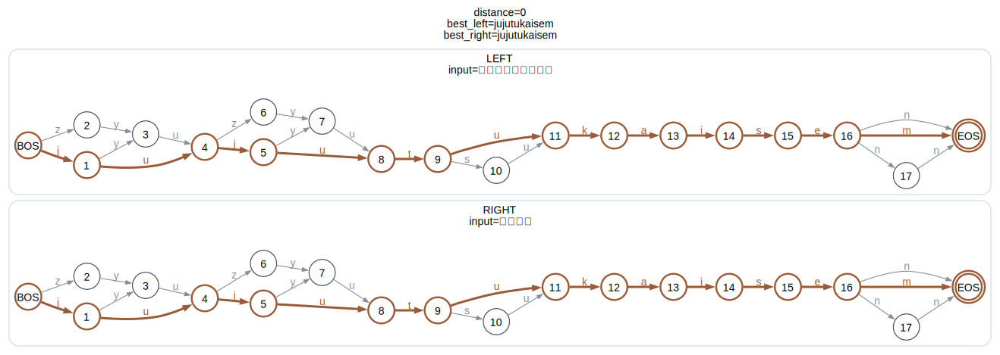
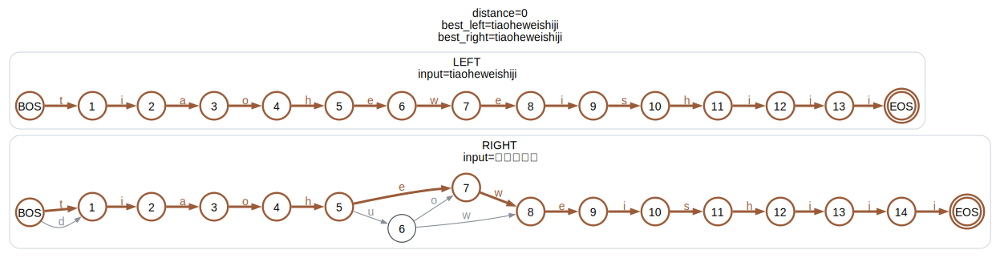

# CLI Usage

The Rust `moine` command can download dictionary artifacts, compare Japanese and
Chinese strings, and render the reading lattice behind a comparison.

## Basic Commands

Download the language artifacts you need:

```bash
moine download ja
moine download ja-unidic
moine download ja-sudachi
moine download zh
```

Inspect the local cache:

```bash
moine list
moine where ja
moine where ja-unidic
moine where ja-sudachi
moine where zh
```

Compare Japanese text through kana/romaji reading paths:

```bash
JA_DIR="$(moine where ja)"

moine compare \
  --left "もいにゃ" \
  --right "モイニャ" \
  --artifact-metadata "$JA_DIR/metadata.yaml"
```

Compare Chinese text through Mandarin pinyin paths:

```bash
ZH_DIR="$(moine where zh)"

moine chinese-compare \
  --left weishiji \
  --right "威士忌" \
  --artifact-metadata "$ZH_DIR/metadata.yaml"
```

## Japanese Lattice Graphs

Install the explicit Japanese artifacts before comparing dictionary sources:

```bash
moine download ja-unidic
moine download ja-sudachi
```

`--romaji-lattice` writes the graph path. `--output-format svg` and
`--output-format png` call the Graphviz `dot` command; use
`--output-format dot` when you want DOT text without Graphviz.

The pair below is useful for checking dictionary-source behavior. The kana input
is already readable as `jujutukaisem`, while the written title depends on the
dictionary reading paths available for `呪術廻戦`.

```bash
UNIDIC_DIR="$(moine where ja-unidic)"

moine compare \
  --left "呪術廻戦" \
  --right "ジュジュツカイセン" \
  --artifact-metadata "$UNIDIC_DIR/metadata.yaml" \
  --romaji-lattice jujutsu-unidic.svg \
  --output-format svg
```

The UniDic-CWJ artifact does not provide a zero-distance title reading for this
pair, so the best path remains three edits away:

```text
source_name:        UniDic-CWJ
ja_dict_lattice: 3
ja_dict_lattice_best_path:
  left:  jujutumawasem
  right: jujutukaisem
```

{ .lattice-preview loading=lazy }

Run the same comparison against the SudachiDict-full artifact:

```bash
SUDACHI_DIR="$(moine where ja-sudachi)"

moine compare \
  --left "呪術廻戦" \
  --right "ジュジュツカイセン" \
  --artifact-metadata "$SUDACHI_DIR/metadata.yaml" \
  --romaji-lattice jujutsu-sudachi.svg \
  --output-format svg
```

SudachiDict-full supplies a matching reading path, so the lattice distance is
zero:

```text
source_name:        SudachiDict
ja_dict_lattice: 0
ja_dict_lattice_best_path:
  left:  jujutukaisem
  right: jujutukaisem
```

{ .lattice-preview loading=lazy }

The highlighted route is the best aligned romaji path; muted arcs are alternate
reading paths considered by the lattice.

## Chinese Lattice Graphs

Chinese comparison uses the same lattice graph output over Mandarin pinyin paths.
The option name is `--pinyin-lattice`:

```bash
moine download zh
CEDICT_DIR="$(moine where zh)"

moine chinese-compare \
  --left tiaoheweishiji \
  --right "调和威士忌" \
  --artifact-metadata "$CEDICT_DIR/metadata.yaml" \
  --pinyin-lattice tiaoheweishiji-pinyin.svg \
  --output-format svg
```

This blended-whisky example is more useful than a single transcription because
the written side expands to several pinyin paths:

```text
pinyin_view: no-tone
right_expansion_paths: 6
cn_pinyin_lattice: 0
cn_pinyin_lattice_best_path:
  left:  tiaoheweishiji
  right: tiaoheweishiji
```

{ .lattice-preview loading=lazy }

Chinese lattice graphs currently show Mandarin pinyin only. They do not model
Cantonese or Jyutping readings.
